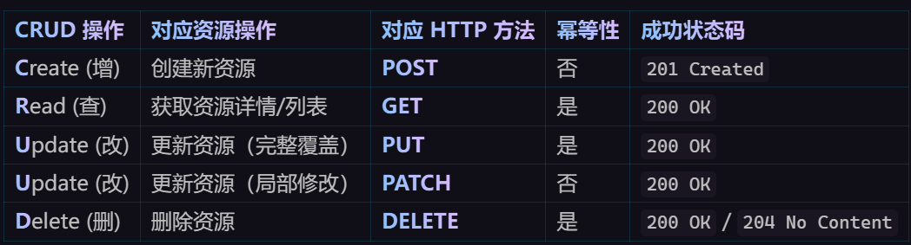

# Gin
## Gin路由
### 基本路由
```go
package main

import (
	"github.com/gin-gonic/gin"
	"net/http"
)

func main() {
	r := gin.Default()
	r.GET("/", func(c *gin.Context) {
		c.String(http.StatusOK, "hello world")
	})
	r.POST("/post", func(c *gin.Context) {
		c.String(http.StatusOK, "post")
	})
	r.PUT("/post")
	r.Run(":8080")
}
```
gin中路由是使用httprouter写的 有想法可以自己写一个
### restful风格的API
rest(Representational State Transfer) 表现层状态转化 即 URL定位资源，HTTP描述操作



*PUT和PATCH的区别*
- PUT：替换。客户端发送完整的实体，服务器用它替换原有的。
- PATCH：修改。客户端只发送需要修改的字段（如只改标题），服务器只更新这部分。

### API获取方法
- 可以通过Context的Param方法获取API参数
- 127.0.0.1：8080/
```go
package main

import (
	"github.com/gin-gonic/gin"
	"net/http"
	"strings"
)

func main() {
	r := gin.Default()
	r.GET("/user/:name/*action", func(c *gin.Context) {
		//Param参数
		name := c.Param("name")
		action := c.Param("action")
		//Trim截取
		action = strings.Trim(action, "/")
		c.String(http.StatusOK, name+" is "+action)
	})
	r.Run() //default port is 8080
}
```
### URL参数
有两种方法获得URL参数
- Query() URL中参数不存在时则返回空值
- DefaultQuery() URL中参数不存在则返回默认值

```go
package main

import (
	"fmt"
	"github.com/gin-gonic/gin"
	"internal/abi"
	"net/http"
)

func main() {
	r := gin.Default()
	r.GET("/user", func(c *gin.Context) {
		name1 := c.Query("name")
		name := c.DefaultQuery("name", "Mike")
		c.String(http.StatusOK, fmt.Sprintf("Hello my name is %s.", name))
	})
	    c.String(http.StatusOK,fmt.Sprintf("my name1 is %s",name1))
	r.Run()
}
//浏览器用 http://127.0.0.1:8080/user?name=Bob 和http://127.0.0.1:8080/user看结果
```
### 表单参数
表单传输是post请求，http常见的传输格式有四种
- application/json
- application/x-www-form-urlencoded
- application/xml
- multipart/form-data

主要介绍application/json 
    现代移动端和前后分离REST的主流标准
     - 数据结构：标准的JSON字符串，例如{"username":"Mike","age":13}
     - 支持复制的分层嵌套结构(数组 对象嵌套)。
     - 几乎适用所有的前后端交互API和Ajax请求/
     - c.ShouldBindJSON()或c.BindJSON()


