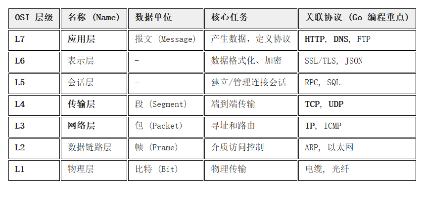

# 面向对象

## 匿名字段

字段采用匿名字段

影响：有多层结构体嵌套的时候出现重复的字段名相互之间不会混淆

```go
package main

import "fmt"

type Person struct {
	name string
	sex  string
	age  int
}

type Student struct {
	*Person
	id   int
	addr string
}

func main() {
	s1 := Student{&Person{"ke", "man", 18}, 1, "zj"}
	fmt.Println(s1)
	fmt.Println(s1.name)
	fmt.Println(s1.Person.name)
}
```

## 接口

interface是一种类型，一种抽象类型

接口定义了一个对象的行为规范，只定义规范不实现，由具体的对象实现规范的细节

```go
package main

import "fmt"

type Speaker interface {
	Say()
}

type Dog struct{}
func (d Dog) Say() {
	fmt.Println("wang")
}

type Robot struct{}
func (r Robot) Say() {
	fmt.Println("di~~~")
}
func Speak(s Speaker)  {
	s.Say()
}
```

``Dog和Robot都具有Say方法就变成了Speaker``

优点：在不改动原代码的基础上，让新类型适配旧逻辑

应用场景

- 支付：支付宝，微信，银联等多种方式进行电子支付，可以当成“支付方式”来处理

go语言提倡面向接口编程

- 接口是一个或多个方法签名的集合。
- 任何类型的方法集中只要拥有该接口‘对应的全部方法’签名，就表示了它实现了该接口无需在该类型上显式声明实现了哪个接口
- 所谓对应方法，是指有相同名称、参数列表（不包括参数名）以及返回值。
- 当然，该类型还可以有其他方法。


- 接口只有方法声明，没有实现，没有数据字段。
- 接口可以匿名嵌入到其他接口或嵌入到结构中。
- 对象赋值给接口时，会发生拷贝，接口内部存储的是指向复制品的指针，既无法修改复制品的状态，也无法获取指针(
  所以用对象的指针赋值给接口可以便于修改对象)。
- 只有当接口存储的类型和对象都为nil时，接口才为nil。
- 接口变量不会自动转换数据类型(写接口的时侯，确保数据类型相同)
- 接口同样支持匿名字段的方法
- 接口也可以实现OOP中的多态(也是唯一途径)
- 空接口可以作为任何数据类型的容器，any现在也行还更简洁

```go
func Println(a ...interface{}) (n int, err error)   
```

- 一个类型可以实现多个接口
- 接口命名习惯以er结尾

### 实现接口的条件

```go
type writer interface{
Write([]byte) error
}
```

    1.接口名writer：使用type将接口定义为自定义的类型名。Go语言的接口在命名时，一般会在单词后面添加er，如有写操作的接口叫Writer，有字符串功能的接口叫Stringer等。接口名最好要能突出该接口的类型含义。
    2.方法名Writer：当方法名首字母是大写且这个接口类型名首字母也是大写时，这个方法可以被接口所在的包（package）之外的代码访问。
    3.参数列表、返回值列表：参数列表和返回值列表中的参数变量名可以省略。

```go
type Player interface{
Run()
Jump()
}
type Student struct{
Name string
}
func (s Student) Run() {
fmt.Printf("%d is running.",s.Name)
}
func (s Student) Jump() {
fmt.Printf("%d is jumping",s.Name)
}
```

`io.Writer` 接口

```go
type Writer interface {
	Write (p []byte)(n int, err error)
}
```

### 接口类型变量

为什么要用接口？
接口类型变量能够存储所有实现了该接口的实例。例如上面的示例中，Speaker类型的变量可以存储dog和cat类型的变量

```go
func main() {
var x Speaker //声明一个Sayer类型的变量x
a := cat{}    //实例化一个cat
b := dog{}    //实例化一个dog
x = a         //可以把cat实例直接赋值给x
x.say()       //喵喵喵
x = b         //可以把dog实例直接赋值给x
x.say()       //汪汪汪
}
```

### 值接收者和指针接收者实现接口的区别

```go
type Mover interface{
move()
}
//值接收者实现接口
type dog struct{}
func (d dog) move(){
fmt.Println("dog can move.")
}
func main () {
var x Mover
var wangcai = dog{}  //wangcai是dog类型 
x = wangcai          //x可以接收dog类型
var laifu = &dog{}   //laifu是*dog类型
x = laifu            //x可以接收*dog类型
x.move()
}
```

从上面的代码可以看出使用值接收者实现接口后，不管是结构体`dog`还是结构体指针`*dog`
类型的变量都可以赋值给接口变量。因为go语言中有对指针类型变量求值的语法糖，dog指针fugui内部会自动求值`*fugui`。

```go
//指针接收者实现接口
func (*d dog) move() {
fmt.Println("dog can move")
}
func main(){
var x Mover
var wangcai = dog{} //wangcai是dog类型	
x = wangcai         //x不可以接受dog类型
var laifu = &dog{}  //富贵是*dog类型
x = laifu           //x可以接收*dog类型
x.move()
}
```

此时Mover接口是`*dog`类型，所以不能给x传入dog类型的 wangcai ，此时x只能存储`*dog`类型的值。

```go
type People interface{
Speak(string) string
}
type Student struct{}
func (stu *student) Speak(think string) (talk string) {
if think == "woo"{
talk="handsome boy."
}else{
talk = "Hello"
}
return
}
func main() {
var peo People = /*&*/Student{}
think := "normal"
fmt.Println(peo.Speak(think))
}
```

## 类型与接口的关系

### 一个类型实现多个接口

一个类型可以同时实现多个接口，而接口间彼此独立，不知道对方的实现。例如，狗可以叫，可以动我们就分别定义`Sayer`和`Mover`
接口，如下`Mover`接口

```go
type Sayer interface{
say()
}
type Mover interface {
move()
}
//dog即可以实现Sayer接口，也可以实现Mover接口
type dog struct {
name string
}
func (d dog) say(){
fmt.Printf("%s brake loudly" , d.name)
}
func (d dog) move() {
fmt.Printf("%s can reach up 30km/h.")
}
func main() {
var x Sayer
var y Mover

var a=dog{name:"wangcai"}
x=a
y=a
x.say()
y.move()
}
```

### 多类型实现同一接口

### 接口嵌套

接口与接口之间可以通过嵌套创造出新的接口。

```go
type Mover interface{
move()
}
type dog struct {
name string
}
type car struct {
brand string
}
func (d dog) move(){
fmt.Printf("%s can reach up 30km/h.",d.name)
}
func (c car) move(){
fmt.Printf("%s can reach up 200km/h.",c.brand)
}
func main() {
var x Mover
var a = dog{name:"jack"}
var b = car{brand:"xiaomi"}
x = a
x.move()
x = b
x.move()
}
```

输出

```text
jack can reach up 30km/h.
xiaomi can reach up 200km/h.
```

并且一个接口的方法，不一定需要由一个类型完全实现，接口实现的方法可以通过在类型中嵌入其他类型或结构体来实现。

```go
package main

import "fmt"

type Hairdryer interface {
	blow()
	heat()
}
type dryer struct{}

func (d dryer) heat() {
	fmt.Println("heating")
}
type daisen struct {
	dryer
}

func (d daisen) blow(){
	fmt.Println("blowing")
}
```

初始化

```go
func main() {
var h Hairdryer
d := daisen{
dryer:dryer{},
}
h=d
h.heat()
h.blow()
}
```

### 接口嵌套

接口与接口之间可以通过嵌套创造出新的接口。

```go
package main

import "fmt"

type Sayer interface {
	say()
}
type Mover interface {
	move()
}
type animal interface {
	Mover
	Sayer
} //嵌套得到的接口的使用与普通接口一样
type cat struct {
	name string
}

func (c cat) say() {
	fmt.Printf("%s say miao~.\n",c.name)
}
func (c cat) move() {
	fmt.Printf("%s move fast.\n", c.name)
}
func main() {
	var x animal
	x = cat{name:"年年"}
	x.move()
	x.say()
}
```

## 空接口

### 空接口是什么

空接口是指没有定义任何方法的接口。因此任何类型都实现了空接口。

`空接口类型的变量可以存储任意类型的变量。`

```go
package main

import "fmt"

func main() {
	var x interface{}
	var s = "note"
	x = s
	fmt.Fprintf("Type is %T , value is %v.\n",x,x)
	var i = 100
	x = i
	fmt.Fprintf("Type is %T , value is %v.\n",x,x)
	var b = true
	x = b
	fmt.Fprintf("Type is %T , value is %v.\n",x,x)
}
```

### 空接口的应用

```go
//空接口作为函数的参数
func show(a interface{}){
	fmt.Printf("Type is %T , value is %v.\n" , a , a )
}
```

```go
//空接口作为map的值
var student_info = make(map[string]interface{})
student_info["name"]="ck"
student_info["age"]=20
student_info["married"]=false
fmt.Println(student_info)
```

## 类型断言

空接口可以存储任意类型的值，那我们如何获取其存储的具体数呢？

一个接口的值是由一个具体类型和一个具体类型的值两部分组成的。

这两部分分别称为接口的动态类型和动态值。

```go
var w io.Write
w = os.Stdout
w = new(bytes.Buffer)
w = nil
```

想要判断空接口中的值的类型就要用类型断言

    x(T)
    x:表示类型为interface{}的变量
    T:表示断言判断的类型

返回两个参数，第一个参数是x转化为T类型后的变量，第二个值是一个布尔值（true成功，false失败）

```go
func main() {
var x interface{}
x="note"
v,ok:=x(string)
if ok{
fmt.Println(v)
}else{
fmt.Println("not string")
}
}
```

```go
//判断接口类型
func justify_type(x interface{}){
switch v := x.(type){
case string:
fmt.Println("type is string")
case int:
fmt.Println("type is int")
case bool:
fmt.Println("type is bool")
default:
fmt.Println("strage type")
}
}
```

因为空接口可以存储任意类型值的特点，所以空接口在go语言中的使用十分广泛。

但是不要为了写接口而写接口。

只有当有两个及以上具体类型必须以相同方式进行处理时才需要定义接口。

# 网络编程

## 互联网协议介绍

互联网的核心是一系列协议，总称为“互联网协议”（Internet Protocol
Suite），正是这一些协议规定了电脑如何连接和组网。我们理解了这些协议就理解了互联网的原理。由于这些协议太过庞大和复杂，没有办法一概而全，只能介绍一下日常开发中接触比较多的协议。

### 互联网分层模型

互联网的逻辑实现别分为好几层。每一层都有自己的功能，就像建筑物一样每一层都靠下一层支撑。用户接触到的只是最上面那一层，根本不会感觉到下面的几层。要理解互联网就需要自下而上理解每一层实现的功能。



#### 物理层

我们要用电脑与外界互联网通信需要先把电脑连接网络，常用的方式有双绞线、光纤、无线电波等方式。就是把电脑连接起来的物理手段。他主要规定了网络的一些电气特性，作用是负责传输0或者1的电信号。

#### 数据链路层

单纯的0和1没有任何意义，所以要规定电信号的解读方式（摩斯电码，也是类似做了一个约定）：例如多少个电信号算一组？每个信号位有何意义？

数据链路层确定了物理传输0和1的分组方式以及代表的意义。现在“以太坊（Ethernet）”协议占据主导地位。

以太网规定，一组电信号构成一个数据包，叫做“帧”（Frame）。每一帧分为两个部分：标头（Head）和数据（Data）。

Head：包含数据包的一些说明项，比如发送者、接收者、数据类型等等 长度固定18B

Data：是数据包的具体内容 长度46~1500B

发送者和接收者是如何标识的呢？

    以太网规定所有接入网络的设备都必须有“网卡“接口，数据包必须从一块网卡传送到另一块网卡。
    网卡的地址，叫做MAC地址（唯一），长度是48个二进制位，通常写成12个十六进制数。
    前六个十六进制数是厂商编号，后六个是该厂商的网卡流水号。

我们通过ARP协议来获取接收方的MAC地址，为了将数据发送给接收方，以太网向本网络内所有的设备都发送数据包，让每台计算机读取这个包的“Head”里的接收方，然后和自己的MAC地址进行比较，如果相同就接受这个包做进一步处理，不同就丢弃这个包

这种发送方式叫“广播”(broadcasting)

#### 网络层

广播有很多缺点：效率低下，且只能在子网络内进行数据传输

因此必须找到一种方法区分哪些MAC地址属于同一个子网络。如果是同一个子网络，就采用广播方式发送，否则就采用**路由**方式发送。这就导致了网络层的诞生。它的作用是引进一套新的地址，使我们能够区分不同的计算机是否属于同一个子网。这套地址就叫网络地址，简称**网址**

网络层诞生后，每台计算机都有了两种地址，一种是MAC地址，另一种是网络地址。两种地址之间没有任何联系，MAC地址是绑定在网卡上的，网络地址则是网络管理员分配的。网络地址帮助我们确定计算机所在的子网络，MAC地址则将数据报送到该子网络中的目标网卡。因此，先处理网络地址再处理MAC地址。

规定网络地址的协议叫做IP协议，它所定义的地址，就叫做IP地址。目前广泛使用的是IP协议第四版，简称IPv4。IPv4规定网络地址由32个二进制位组成通常分成4段十进制数表示(0.0.0.0~255.255.255.255)

根据IP协议发送的数据包就叫做IP数据包，IP数据包分为“标头”和“数据”。

标头（20B~60B）包括版本、长度、IP地址等信息，数据是具体内容

IP数据包最大为65535B。

#### 传输层

MAC地址和IP地址，解决了不同计算机之间如何取得联系的问题。新的问题来了同一台计算机上会有很多应用，如何区分哪个数据包归哪个应用呢？

所以我们还需要一个参数决定哪个程序（进程）使用这个数据包，这个参数就叫做“端口”（port），port是每一个使用网卡的程序的编号。每个数据包都发到主机的特定端口所以不同的程序就能取到自己所需的数据。

端口值为0~65535之间的整数，正好16个二进制位，0~1023的端口被系统占用。现在我们唯一确定了互联网上的一个程序，进而实现网络间的程序通信。

我们需要在数据包中加入端口，这就需要新的协议。最简单的实现叫做UDP协议，它的格式几乎就是在数据前面加上端口号。UDP数据包也是由“标头”和“数据”两部分组成。表头部分定义了发出端口和接收端口，“数据”部分就是具体内容。UDP数据包，标头部分8B，总长度不超过65535B。

UDP协议比较简单，容易实现，但缺点是可靠性差，一旦数据包发出就无法知道对方是否收到。为了解决这个问题，提高网络的可靠性，TCP协议就诞生了。

TCP协议能够确保数据不被遗失，缺点是过程复杂、实现困难、消耗较多的资源。TCP数据包没有长度限制，理论上可以无限长，但是为了保证网络的效率，通常数据包的长度不会超过IP数据包的长度，以确保单个TCP数据包不必再分割。

#### 应用层

应用程序收到传输层的数据，接下来就要对数据进行解包。由于互联网是开放架构数据来源五花八门，必须事先规定好通信的数据格式，否则接收方根本无法获取真正发送的数据内容。应用层的作用就是规定应用程序使用的数据格式，例如我们在TCP协议上常见的Email、HTTP、FTP等协议，这些协议就组成了互联网协议的应用层

## socket编程

Socket是BSD UNIX的进程通信机制，通常也称作套接字，用于描述IP地址和端口，是一个通信链的句柄。Socket可以理解成TCP/IP网络的API，它定义了很多函数或例程，程序员可以用它们来开发TCP/IP网络上的应用程序。电脑上运行的应用程序通常通过套接字向网络发出请求或应答请求。

Socket是应用层与TCP/IP层中间软件抽象层。在设计模式中socket其实就是一个门面模式，它把复杂的TCP/IP协议族放在Socket后面，对用户来说只需要调用Socket规定的相关函数，让Socket组织符合指定的协议数据然后进行通信。

常用的Socket有两种，流式Socket和数据报式Socket，流式是一种面向连接的Socket，针对于面向连接的TCP服务应用，数据报式Socket是一种无连接的Socket，针对于无连接的UDP服务应用

一般直播用UDP

### TCP编程

#### TCP协议

传输控制协议/网间协议（TCP/IP）一种面向连接、可靠、依靠字节流的传输层通讯协议。

因为数据像水一样传输，会出现黏包问题

#### TCP服务端

一个TCP服务端可以同时连接很多个客户端，例如世界各地的用户使用浏览器登录淘宝官网，因为go语言中创建多个goroutine实现并发非常方便，所以我们可以每创建一次链接就创建一个goroutine

TCP服务端程序的处理流程

1. 监听端口
2. 接收客户端请求建立链接
3. 创建gorounite处理链接

```go
//使用net包实现TCP代码如下

//tcp/server/main.go

//TCP serve端

package main

import (
	"bufio"
	"fmt"
	"net"
)

func process(conn net.Conn) {
	defer conn.Close() //关闭连接
	for {
		reader := bufio.NewReader(conn)
		var buf [128]byte
		n, err := reader.Read(buf[:]) //读取数据
		if err != nil {
			fmt.Println("read from client failed", err )
			break
		}
		recvStr := string(buf[:n])
		fmt.Println("收到client端发来的数据：",recvStr)
		conn.Write([]byte(recvStr)) //发送数据
	}
}

func main() {
	listen,err :=net.Listen("tcp","127.0.0.1:20000")
	if err != nil {
		fmt.Println("Listen failed , err",err)
		return
	}
	for {
		conn , err := listen.Accept()//建立连接
		if err != nil {
			fmt.Println("accept failed,err",err)
			continue
		}
		go process(conn)//启动一个goroutine处理链接
	}
}
//将代码编译成server.exe可执行文件
```
#### TCP客户端

TCP客户端的通信流程
1. 建立与服务端的链接
2. 进行数据收发
3. 关闭链接

```go
//tcp/client/main.go

//客户端
package main

import (
	"bufio"
	"fmt"
	"golang.org/x/arch/ppc64/ppc64asm"
	"net"
	"os"
	"strings"
)

func main() {
	conn, err := net.Dial("tcp", "127.0.0.1:20000")
	if err != nil {
		fmt.Println("err:", err)
		return
	}
	defer conn.Close() //
	inputReader := bufio.NewReader(os.Stdin)
	for {
		input, _ := inputReader.ReadString("\n") //
		inputInfo := strings.Trim(input, "\r\n")
		if strings.ToUpper(inputInfo) == "Q" {
			return
		}
		buf := [512]byte()
		n, err := conn.Read(buf[:])
		if err != nil {
			fmt.Println("recv failed, err", err)
			return
		}
		fmt.Println(string(buf[:]))
	}
}
//编译成client.exe可执行文件先启动server再启动client在client端输入任意内容就能够在server端发送的数据从而实现TCP通信
```

### UDP编程

#### UDP协议

UDP协议(User Datagram Protocol)中文名称是用户数据报协议,是OSI(Open Systerm Interconnection,开放式系统互连)参考模型中一种无连接的传输层协议不需要建立连接就能直接进行数据发送和接受,属于不可靠的、没有时序的通信，但是UDP协议的实时性比较好，通常用于视频直播相关领域

#### UDP服务端
```go
//UDP/server/main.go
package main

import (
	"fmt"
	"net"
)

func main() {
	listen, err := net.ListenUDP("udp", &net.UDPAddr{
		IP: net.IPv4(0.0.0.0),
		port:   30000,
	})
	if err != nil {
		fmt.Println("listen failed ,err", err)
		return
	}
	defer listen.Close()
	for true {
		var data [1024]byte
		n, addr, err := listen.ReadFromUDP(data[:])
		if err != nil {
			fmt.Println("read udp failed ,err", err)
			return
		}
		fmt.Println("data%v addr%v count%v\n", string(data[:n]), addr, n)
		_, err = listen.WriteToUDP(data[:n], addr)
		if err != nil {
			fmt.Println("write to udp failed , err ",err )
			continue
		}

	}
}
```
#### UDP客户端

```go
package main

import (
	"fmt"
	"net"
)

func main() {
	socket, err := net.DialUDP("udp", nil, &net.UDPAddr{
		IP: net.IPv4(0.0.0.0),
		Port:   30000,
	})
	if err != nil {
		fmt.Println("conect serve faile,err ", err)
		return
	}
	defer socket.Close()
	sendData := []byte("Hello serve")
	_, err = socket.Write(sendData)
	if err != nil {
		fmt.Println("send data failed , err", err)
		return
	}
	data := make([]byte, 4096)
	n, remoteAddr, err := socket.ReadFromUDP(data)
	if err != nil {
		fmt.Println("receive data failed , err",err )
		return
	}
	fmt.Printf("recv%v addr%v count%v\n",string(data[:n]),remoteAddr,n)

}
```
### TCP黏包

```go
//服务端
//socket_stick/server/main.go
package main

import (
	"bufio"
	"cmd/compile/internal/syntax"
	"cmd/go/internal/fmtcmd"
	"fmt"
	"io"
	"net"
)

func process(conn net.Conn) {
	defer conn.Close()
	reader := bufio.NewReader(conn)
	var buf := [1024]byte
	for {
		n, err := reader.Read(buf[:])
		if err == io.EOF {
			break
		}
		if err != nil {
			fmt.Println("read from client failed , err", err)
			break
		}
		recvStr := string(buf[:n])
		fmt.Println("read from client data :", recvStr)
	}
}
func main() {
	listen, err := net.Listen("tcp", "127.0.0.1:30000")
	if err != nil {
		fmt.Println("listen failed ,err", err)
		return
	}
	defer listen.Close()
	for true {
		conn, err := listen.Accept()
		if err != nil {
			fmt.Println("accept failed , err",err)
			continue
		}
		go process(conn)
	}
}
```

```go
//客户端
//socket_stick/client/main.go
package main

import (
	"fmt"
	"net"
)

func main() {
	conn, err := net.Dial("tcp", "127.0.0.1:30000")
	if err != nil {
		fmt.Println("dial failed , err ", err)
		return
	}
	defer conn.Close()
	for i := 0; i < 20; i++ {
		msg := `Hello How are you`
		conn.Write([]byte(msg))
	}
}
```
这样的代码编译后运行先启动服务端再启动客户端 运行结果如下
```text
read from client data : Hello How are youHello How are youHello How are youHello How are youHello How are youHello How are youHello How are youHello How are youHello How are youHello How are youHello How are youHello How are youHello How are youHello How are youHello How are youHello How are youHello How are youHello How are youHello How are youHello How are you
```
#### 为什么会黏包
tcp是流式数据，在保持长链接的时候可以进行多次的收发
黏包会发生在发送端也会发生在接收端
1. 由nagle算法造成的发送端黏包：nagle算法是一种改善网络传输效率的算法。简单来说就是当我梦提交一段数据给TCP发送时，TCP并不立刻发送这段数据，而是等待一小段时间看看等待期间是否还有要发送的数据，若有则会一次把这两段数据发送出去。
2. 接收端接受不及时造成的接收端黏包：TCP会把接收到的数据存在自己的缓冲区域内，然后通知应用层取数据。当应用层由于某些原因不能及时的把TCP的数据取出来，就会造成TCP缓冲区中存放了几段数据。

#### 怎么解决黏包
出现黏包主要在于接收方不确定传进来的数据大小，因此我们可以对数据包进行封包和拆包操作。

封包就是给一段数据加上包头（过滤非法包时封包会加入包尾内容）。包头部分长度是固定的，并且它存储了包体的长度，根据报头长度固定以及包头中含有胞体长度的变量，就能够正确拆解出一个完整的数据包。

我们可以自己定义一个协议，比如数据包的前四个字节为包头，里面存储的是发送数据的长度
```go

```


### HTTP编程

- web服务器的工作流程可以简单地归纳
    - 客户机通过TCP/IP协议建立到服务器的TCP连接
    - 客户端向服务器发送HTTP协议请求包，请求服务器里的资源文档
    - 服务端向客户机发送HTTP协议应答包，如果请求的资源包含有动态语言的内容，那么服务器会调用动态语言的解释引擎负责处理“动态内容”，并将处理得到的结果返回客户端。
    - 客户机与服务端断开。由客户端解释HTML文档。
- HTTP(HyperText Transfer protocol)协议，超文本传输协议是互联网上应用最为广泛的一种互联网协议，它详细规定了浏览器和万维网服务器之间互相通信的规则，通过因特网传送万维网文档的数据传输协议
- HTTP协议通常承载于TCP协议之上

#### HTTP服务端

```go
package main

import (
	"fmt"
	"net/http"
)

func main() {
	//http://127.0.0.0:8000/go
	//单独写回调函数
	http.HandleFunc("go", myHandler)
	//http.HandleFunc("ungo",myHandler2)
	//addr：监听的地址
	//handler：回调函数
	http.ListenAndServe("127.0.0.1:8000", nil)
}

//handle函数
func myHandler(w http.ResponseWriter, r *http.Request) {
	fmt.Println(r.RemoteAddr,"连接成功")
	//请求方式GET POST DELETE PUT UPDATE
	fmt.Println("method:",r.Method)
	// /go
	fmt.Println("url",r.URL.Path)
	fmt.Println("header",r.Header)
	fmt.Println("body",r.Body)
	//回复
	w.Write([]byte("LESS NOTE"))
}
```

#### HTTP客户端

```go
package main

import (
	"fmt"
	"io"
	"net/http"
)

func main() {
	//resp, _ := http.Get("http://baidu.com")
	//fmt.Println(resp)
	resp, _ := http.Get("127.0.0.0:8000/go")
	defer resp.Body.Close()
	//200 OK
	fmt.Println(resp.Status)
	fmt.Println(resp.Header)
	buf := make([]byte, 1024)
	for {
		//接受服务端信息
		n, err := resp.Body.Read(buf)
		if err != nil && err != io.EOF {
			fmt.Println(err)
			return
		} else {
			fmt.Println("read success")
			res := string(buf[:n])
			fmt.Println(res)
			break
		}
	}
}
```


